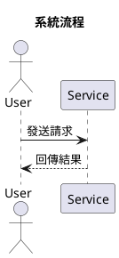
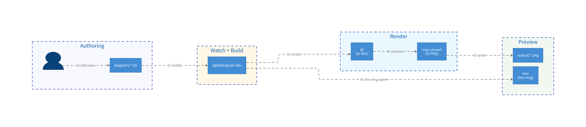

# agentUML

以 Nix Flake 驅動的響應式 PlantUML 圖表開發環境。儲存 `.puml` 檔案，圖片立即自動更新。

## 需求

- [Nix](https://nixos.org/download)（需啟用 Flakes）
- Wayland 顯示環境（`imv` 預覽器使用）

## 快速開始

```sh
# 初始化目錄
just init

# 一鍵啟動監聽 + 預覽
just dev
```

> 若你用 direnv（`use flake`）已進入 dev shell，`Justfile` 會直接跑 `agentuml-*`；否則才會自動用 `nix develop --command ...` 啟動環境。

之後只要在 `diagrams/` 內儲存任何 `.puml` 檔案，`output/` 內的圖片就會自動更新，`imv` 預覽視窗同步切換。

> `just dev` 會啟動 `agentuml-dev`：單一程序同時負責編譯與預覽。

### 預覽行為

- `agentuml-dev` 會監聽 `diagrams/` 的 `.puml` 變更，編譯後用 `imv-msg` 自動切到對應的 `output/<name>.png`。
- 之後只監聽 `diagrams/` 的檔案事件（包含 atomic save 的 `moved_to`），用 `.puml` 檔名推導要顯示的圖片。
- 若你用 direnv 的 `use flake`（pure）修改了 `scripts/` 或 `flake.nix`，需要 `git add` + `direnv reload`，並重新執行 `just dev` 才會套用到新的 `/nix/store` wrapper。

## 目錄結構

```
agentUML/
├── flake.nix        # 環境定義（唯一事實來源）
├── flake.lock       # 鎖定的 Nix input 版本
├── Justfile         # 常用指令包裝
├── scripts/         # 非 Nix 環境可直接執行的腳本
├── diagrams/        # 放置 .puml 原始檔（需自行建立）
└── output/          # 自動產生的 PNG/SVG（已 gitignore）
```

## 常用指令

> 在沒有 direnv 的情況下，`Justfile` 會用 `nix develop --command ...` 呼叫 `agentuml-*` 指令。非 Nix 環境請參考下方「非 Nix 環境使用」。

| 指令 | 說明 |
|---|---|
| `just dev` | **一鍵啟動**編譯 + 預覽（單一程序）|
| `just build` | 一次性編譯所有 `.puml` |
| `just compile <file>` | 編譯單一圖表 |
| `just clean` | 清除 `output/` |
| `just check` | 驗證 `flake.nix` 語法 |

## 撰寫圖表

在 `diagrams/` 建立 `.puml` 檔案：



### 圖表類型與 Graphviz 依賴

| 類型 | 需要 Graphviz |
|---|---|
| Sequence（循序圖） | 否 |
| Use Case（用例圖） | 否 |
| Activity（活動圖） | 否 |
| Class（類別圖） | 是 |
| State（狀態圖） | 是 |
| Component（元件圖） | 是 |
| Deployment（部署圖） | 是 |

## 非 Nix 環境使用

如果你在沒有 Nix 的環境也想使用本專案流程，可以直接執行 `scripts/` 內的腳本。

### 需要的工具

請確保以下指令在 `$PATH` 中可用：
- `plantuml`（以及 Java runtime）
- `graphviz`（Class/State/Component/Deployment 等圖表需要）
- `inotifywait`（通常來自 `inotify-tools`）
- `imv`、`imv-msg`

### 用法

```sh
# 初始化目錄
mkdir -p diagrams output

# 一鍵啟動
./scripts/agentuml-dev.sh

```

如果你希望沿用 `Justfile`，可自行把 `scripts/` 加到 PATH：

```sh
export PATH="$PWD/scripts:$PATH"
just dev
```

## 工具鏈

| 工具 | 用途 |
|---|---|
| [PlantUML](https://plantuml.com) | `.puml` → PNG/SVG 編譯器 |
| [inotify-tools](https://github.com/inotify-tools/inotify-tools) | 檔案變動監聽 (`inotifywait`) |
| [imv](https://sr.ht/~exec64/imv/) | Wayland 原生圖片預覽（目錄瀏覽） |
| [Graphviz](https://graphviz.org) | 複雜圖表的排版後端 |
| [Nix Flakes](https://nixos.wiki/wiki/Flakes) | 可重現的開發環境 |

## Sample

### Workflow（Sequence）



### GOT

詢問冰與火之歌的人物關係圖


## License

MIT
