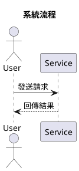
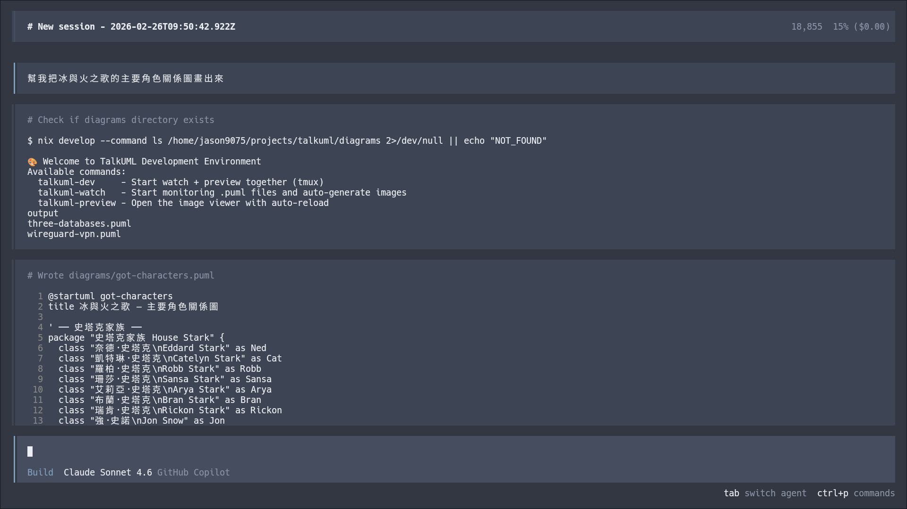
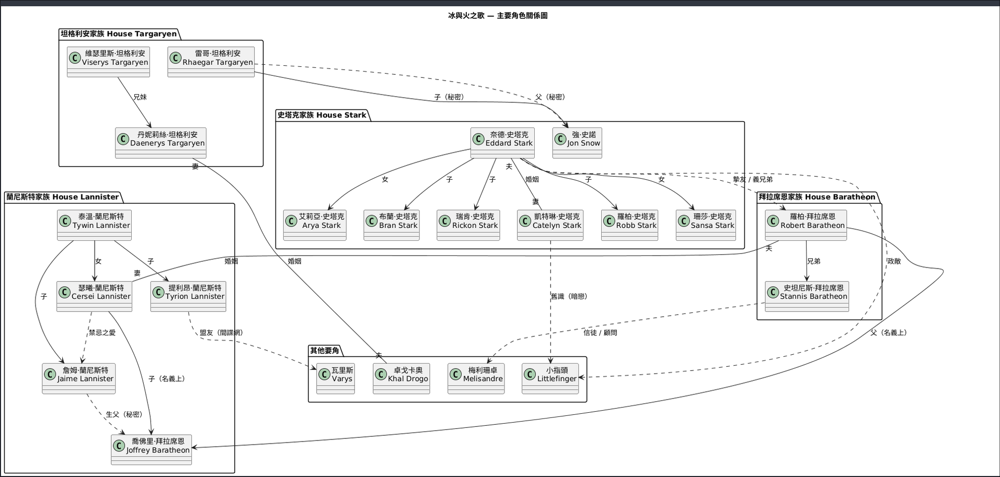

# TalkUML

以 Nix Flake 驅動的響應式 PlantUML 圖表開發環境。儲存 `.puml` 檔案，圖片立即自動更新。

## 需求

- [Nix](https://nixos.org/download)（需啟用 Flakes）
- Wayland 顯示環境（`imv` 預覽器使用）

## 快速開始

```sh
# 1. 進入 dev shell（所有工具皆由 Nix 管理）
nix develop

# 2. 初始化目錄
just init

# 3. 一鍵啟動監聽 + 預覽（tmux 自動分割視窗）
just dev
```

之後只要在 `diagrams/` 內儲存任何 `.puml` 檔案，`output/` 內的圖片就會自動更新，`imv` 預覽視窗同步重載。

> `just dev` 會開啟一個 tmux session，左側跑 `talkuml-watch`，右側跑 `talkuml-preview`。
> 離開請按 `Ctrl+b d` detach，或 `Ctrl+b x` 關閉 pane。

## 目錄結構

```
talkuml/
├── flake.nix        # 環境定義（唯一事實來源）
├── flake.lock       # 鎖定的 Nix input 版本
├── Justfile         # 常用指令包裝
├── scripts/         # 非 Nix 環境可直接執行的腳本
├── diagrams/        # 放置 .puml 原始檔（需自行建立）
└── output/          # 自動產生的 PNG/SVG（已 gitignore）
```

## 常用指令

> 在 Nix dev shell 內，`Justfile` 會呼叫 `talkuml-*` 指令。非 Nix 環境請參考下方「非 Nix 環境使用」。

| 指令 | 說明 |
|---|---|
| `just dev` | **一鍵啟動** watch + preview（tmux 分割視窗）|
| `just watch` | 單獨啟動監聽，存檔即重新編譯 |
| `just preview` | 單獨開啟 imv 圖片預覽器 |
| `just build` | 一次性編譯所有 `.puml` |
| `just compile <file>` | 編譯單一圖表 |
| `just clean` | 清除 `output/` |
| `just check` | 驗證 `flake.nix` 語法 |

## 撰寫圖表

在 `diagrams/` 建立 `.puml` 檔案：



### 圖表類型與 Graphviz 依賴

| 類型 | 需要 Graphviz |
|---|---|
| Sequence（循序圖） | 否 |
| Use Case（用例圖） | 否 |
| Activity（活動圖） | 否 |
| Class（類別圖） | 是 |
| State（狀態圖） | 是 |
| Component（元件圖） | 是 |
| Deployment（部署圖） | 是 |

## 非 Nix 環境使用

如果你在沒有 Nix 的環境也想使用本專案流程，可以直接執行 `scripts/` 內的腳本。

### 需要的工具

請確保以下指令在 `$PATH` 中可用：
- `plantuml`（以及 Java runtime）
- `graphviz`（Class/State/Component/Deployment 等圖表需要）
- `entr`
- `inotifywait`（通常來自 `inotify-tools`）
- `imv`、`imv-msg`
- `tmux`（如果要用一鍵 `dev`）

### 用法

```sh
# 初始化目錄
mkdir -p diagrams output

# 一鍵啟動（tmux）
./scripts/talkuml-dev.sh

# 或分開跑
./scripts/talkuml-watch.sh
./scripts/talkuml-preview.sh
```

如果你希望沿用 `Justfile`，可自行把 `scripts/` 加到 PATH：

```sh
export PATH="$PWD/scripts:$PATH"
just dev
```

## 工具鏈

| 工具 | 用途 |
|---|---|
| [PlantUML](https://plantuml.com) | `.puml` → PNG/SVG 編譯器 |
| [entr](https://eradman.com/entrproject/) | 檔案變動監聽 |
| [tmux](https://github.com/tmux/tmux) | `just dev` 一鍵分割視窗 |
| [imv](https://sr.ht/~exec64/imv/) | Wayland 原生圖片預覽（目錄瀏覽） |
| [Graphviz](https://graphviz.org) | 複雜圖表的排版後端 |
| [Nix Flakes](https://nixos.wiki/wiki/Flakes) | 可重現的開發環境 |

## Sample

詢問冰與火之歌的人物關係圖


## License

MIT
